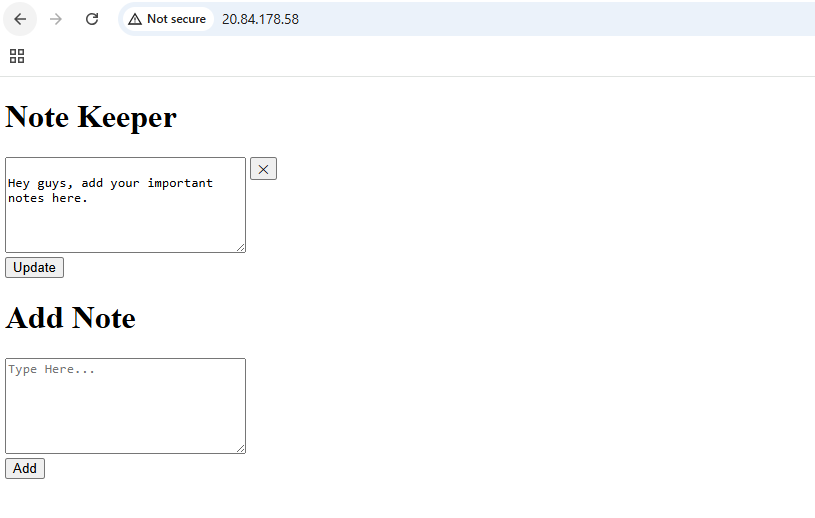

# notes-app-ci/cd-example
Simple Node.js application with unit tests to show how to automate tests using Harness CI!


## Install
```
<<<<<<< HEAD
git clone https://github.com/prasantkumardas/kubernetes-for-everyone/tree/main/notes-app 
=======
git clone (https://github.com/prasantkumardas/kubernetes-for-everyone/tree/main/notes-app)
>>>>>>> d48b39fc7b6fdfa8bbdf3ef8e084c53c5feb202f
```
```
cd notes-app-cicd
```
```
npm install
```

## Run
```
node app.js
```
Visit http://localhost:3000 in your browser

## Test
To run tests
```
npm test
```
<<<<<<< HEAD
If you are using Kubernetes in cloud you can access using external IP.



=======

If you are using Kubernetes in cloud you can access using external IP.


>>>>>>> d48b39fc7b6fdfa8bbdf3ef8e084c53c5feb202f
